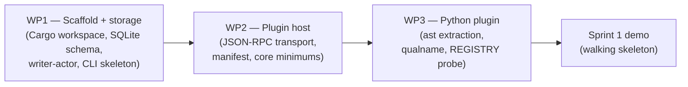

# Clarion Sprint 1 — Walking Skeleton

**Status**: DRAFT — pending design review and Filigree seeding
**Sprint goal**: [Tier A — walking skeleton](./signoffs.md#tier-a--sprint-1-close-walking-skeleton)
**Scope**: WP1 (scaffold + storage) → WP2 (plugin protocol + hybrid authority) → WP3 (Python plugin v0.1 baseline)
**Predecessor plan**: [`../v0.1-plan.md`](../v0.1-plan.md)
**Scope memo**: [`../../clarion/v0.1/plans/v0.1-scope-commitments.md`](../../clarion/v0.1/plans/v0.1-scope-commitments.md)
**Gate to close**: every checkbox ticked in [`signoffs.md`](./signoffs.md) Tier A.

---

## 1. Sprint 1 in one paragraph

Sprint 1 ships the smallest end-to-end state of Clarion that exercises every interface
contract the rest of v0.1 depends on. After Sprint 1 closes, `clarion install` creates a
real `.clarion/` directory; `clarion analyze <fixture-py-file>` spawns the Python
plugin, the plugin emits at least one entity (a Python function), the writer-actor
persists it to SQLite, and a shell-level `sqlite3` query reads it back. No clustering,
no rendering, no findings, no LLM — just the spine. The point is to lock in the storage
schema, entity-ID format, writer-actor protocol, plugin JSON-RPC transport, plugin
manifest schema, core-enforced safety minimums, and Python qualname format **once**,
before Sprint 2's pipeline work starts layering on top of them.

## 2. Critical path



Per-WP docs:
- [`wp1-scaffold.md`](./wp1-scaffold.md)
- [`wp2-plugin-host.md`](./wp2-plugin-host.md)
- [`wp3-python-plugin.md`](./wp3-python-plugin.md)

## 3. Demo script (Sprint 1 close proof)

From a clean checkout, the following must succeed end-to-end in order:

```bash
# 1. Build
cargo build --workspace --release

# 2. Install the Python plugin (editable, from its own subpath)
pip install -e plugins/python

# 3. Init a scratch project
mkdir -p /tmp/clarion-demo && cd /tmp/clarion-demo
echo 'def hello(): return "world"' > demo.py

# 4. Clarion install → .clarion/ created with DB + default config
clarion install
test -f .clarion/clarion.db

# 5. Clarion analyze → plugin spawned, entity persisted
clarion analyze .

# 6. Entity visible via raw SQL — column is `id` (L2 EntityId), not `canonical_name`
sqlite3 .clarion/clarion.db "select id, kind from entities;"
# expected: python:function:demo.hello|function (per the locked 3-segment L2 format)
```

Each of these steps is owned by a Sprint 1 WP:

| Step | Owning WP | Exercises lock-in |
|---|---|---|
| 1 | WP1 | Crate topology, build hygiene |
| 2 | WP3 | Python plugin packaging, plugin-discovery convention (L9) |
| 3 | (scratch prep) | — |
| 4 | WP1 | `clarion install` + schema migration (L1) + writer-actor init (L3) |
| 5 | WP1 + WP2 + WP3 | JSON-RPC transport (L4) + manifest validation (L5) + core-enforced minimums (L6) + qualname production (L7) + REGISTRY probe (L8) |
| 6 | WP1 | Schema shape (L1) + entity-ID 3-segment format (L2) |

## 4. Lock-in summary

Sprint 1 commits the following design surfaces. Each is cheap to change *before*
Sprint 1 closes and expensive to change afterwards — Sprint 2+ WPs will read and write
against these shapes directly. The canonical source for each item is the linked section
in its owning WP doc.

| # | Lock-in | Owning WP | Canonical section | `↗` cross-product touch |
|---|---|---|---|---|
| L1 | SQLite schema shape per [detailed-design §3](../../clarion/v0.1/detailed-design.md#3-storage-implementation) — tables `entities`, `entity_tags`, `edges`, `findings`, `summary_cache`, `runs`, `schema_migrations`; `entity_fts` FTS5 virtual table + triggers; generated columns + indexes; `guidance_sheets` view _(locked on 2026-04-18)_ | WP1 | [`wp1-scaffold.md#l1--sqlite-schema-shape`](./wp1-scaffold.md#l1--sqlite-schema-shape) | `↗` Filigree `registry_backend: clarion` (WP10) reads via entity-ID columns |
| L2 | Entity-ID 3-segment format `{plugin_id}:{kind}:{canonical_qualified_name}` per ADR-003 + ADR-022 _(locked on 2026-04-18)_ | WP1 + WP3 | [`wp1-scaffold.md#l2--entity-id-canonical-name-format`](./wp1-scaffold.md#l2--entity-id-canonical-name-format) | `↗` Wardline qualname reconciliation (ADR-018) uses the third segment as its Clarion-side join key |
| L3 | Writer-actor command protocol (`tokio::task` + bounded `mpsc` + per-N commit) per ADR-011 _(locked on 2026-04-18)_ | WP1 | [`wp1-scaffold.md#l3--writer-actor-command-protocol`](./wp1-scaffold.md#l3--writer-actor-command-protocol) | — |
| L4 | JSON-RPC method set + Content-Length framing per ADR-002 | WP2 | [`wp2-plugin-host.md#l4--json-rpc-method-set--content-length-framing`](./wp2-plugin-host.md#l4--json-rpc-method-set--content-length-framing) | — |
| L5 | `plugin.toml` manifest schema per ADR-022 | WP2 | [`wp2-plugin-host.md#l5--plugintoml-manifest-schema`](./wp2-plugin-host.md#l5--plugintoml-manifest-schema) | — |
| L6 | Core-enforced minimums per ADR-021: path jail (drop on first offense; >10 escapes/60s → kill), 8 MiB Content-Length ceiling, 500k per-run entity cap, 2 GiB RSS `prlimit` | WP2 | [`wp2-plugin-host.md#l6--core-enforced-minimums`](./wp2-plugin-host.md#l6--core-enforced-minimums) | — |
| L7 | Python qualified-name production format (third segment of L2) | WP3 | [`wp3-python-plugin.md#l7--python-qualified-name-production-format`](./wp3-python-plugin.md#l7--python-qualified-name-production-format) | `↗` ADR-018 — Filigree triage and Wardline annotations key off this |
| L8 | Wardline `REGISTRY` direct-import + version-pin protocol | WP3 | [`wp3-python-plugin.md#l8--wardline-registry-import--version-pin-protocol`](./wp3-python-plugin.md#l8--wardline-registry-import--version-pin-protocol) | `↗` Wardline — once pinned, `wardline.core.registry.REGISTRY` cannot be renamed without a coordinated bump |
| L9 | `plugin.toml` discovery convention (where the manifest lives, how the host finds it) | WP2 + WP3 | [`wp2-plugin-host.md#l9--plugin-discovery-convention`](./wp2-plugin-host.md#l9--plugin-discovery-convention) | — |

**Items deliberately NOT locked by Sprint 1** (kept cheap-to-change for later sprints):
- `clarion.yaml` config schema — stubbed only; WP6 (LLM dispatch) forces the full shape.
- Findings emission format — ADR-004 already locked; Sprint 1 does not emit findings.
- MCP tool catalogue — WP8 owns.
- Cluster algorithm + subsystem detection — WP4 owns.
- Summary cache key — WP6 owns.
- Briefing composition — WP7 owns.

## 5. Cross-product change roll-up

**One-glance answer to "are we asking Filigree or Wardline for anything yet?"**

| Sibling | Change required in Sprint 1? | Notes |
|---|---|---|
| Filigree | **No** | Sprint 1 does not emit findings or observations; no `registry_backend` work yet (that's WP10). Filigree need not be installed or running for Sprint 1 to close. |
| Wardline | **No code changes; import only** | WP3 pins the import path `wardline.core.registry.REGISTRY` and declares a version range in `plugin.toml`. UQ-WP3-03 is resolved "fully wire": the probe actually imports Wardline at `initialize` time. Both symbols were verified to exist at sprint start (`wardline/src/wardline/core/registry.py:55`, `wardline/src/wardline/__init__.py:3`). No Wardline-side code changes in Sprint 1. |

This means Sprint 1 can close in isolation — the Filigree repo and the Wardline repo do
not require coordinated work for this sprint. Sprint 2+ (WP9, WP10) will.

## 6. Unresolved questions roll-up

Each WP doc has its own liberal unresolved-questions section. The ones that affect
more than one WP (and therefore could force rework if resolved late) are:

| # | Question | Owning WP(s) | Resolution by |
|---|---|---|---|
| UQ-S1-01 | ~~Rust async runtime choice~~ — **resolved by ADR-011**: `tokio`. Writer-actor is a `tokio::task`; WP2/WP8 inherit the same runtime. | WP1 + WP2 | Resolved pre-sprint |
| UQ-S1-02 | ~~SQLite crate choice~~ — **resolved by ADR-011**: `rusqlite` (with `deadpool-sqlite` for the reader pool). | WP1 | Resolved pre-sprint |
| UQ-S1-03 | JSON-RPC library choice (hand-rolled over `serde_json` vs `jsonrpsee` vs other) | WP2 | Before WP2 Task 2 |
| UQ-S1-04 | Plugin discovery mechanism (PATH-based like `git` subcommands vs explicit `~/.config/clarion/plugins/` vs config-listed paths) | WP2 + WP3 | Before WP2 Task 5 |
| UQ-S1-05 | ~~Whether WP3 imports `wardline.core.registry.REGISTRY` or stubs the probe~~ — **resolved "fully wire"**; symbol existence verified at `wardline/src/wardline/core/registry.py:55` and `wardline/src/wardline/__init__.py:3` (2026-04-18 pre-sprint check). | WP3 | Resolved pre-sprint |
| UQ-S1-06 | Minimum supported Python version for the plugin (3.11? 3.12?) | WP3 | Before WP3 Task 1 |
| UQ-S1-07 | Whether the writer-actor batches acks per-transaction or per-command | WP1 | Before WP1 Task 6 |
| UQ-S1-08 | Shape of plugin's non-entity diagnostic output (progress, logs) — JSON-RPC notifications vs stderr | WP2 | Before WP2 Task 3 |

Each WP doc may add more sprint-local UQs in its own section. The roll-up here is for
items that touch more than one WP.

## 7. Out of scope for Sprint 1

These are valuable but deferred — trying to pull them in threatens the walking-skeleton
goal of "cheap to revise based on what we learn". Named explicitly so nobody has to
re-litigate during the sprint:

- Clustering, subsystem detection, cross-cutting findings — all WP4 work.
- LLM dispatch, summary cache, briefings — WP6 work.
- Guidance system — WP7.
- `clarion serve` (MCP or HTTP) — WP8; Sprint 1 ships only `install` and `analyze` subcommands.
- Secret scanner — WP5.
- Findings emission to Filigree, observation transport — WP9.
- `registry_backend: clarion` mode in Filigree — WP10.
- Full Python-plugin feature coverage (all `CLA-PY-*` rules, every entity/edge kind) — deferred to the WP3-feature-complete sprint.
- macOS/Windows support — Sprint 1 is Linux only. Cross-platform is future work.

## 8. Filigree seeding

Sprint 1 should be seeded as three Filigree issues before work starts:

- `WP1 — Scaffold + storage` — body links to [`wp1-scaffold.md`](./wp1-scaffold.md); label
  `release:v0.1`, `sprint:1`, `wp:1`, plus ADR labels (`adr:001`, `adr:003`, `adr:011`).
- `WP2 — Plugin protocol + hybrid authority` — body links to
  [`wp2-plugin-host.md`](./wp2-plugin-host.md); labels `release:v0.1`, `sprint:1`, `wp:2`,
  `adr:002`, `adr:021`, `adr:022`.
- `WP3 — Python plugin v0.1 baseline` — body links to
  [`wp3-python-plugin.md`](./wp3-python-plugin.md); labels `release:v0.1`, `sprint:1`,
  `wp:3`, `adr:018`, `adr:022`.

Dependencies: WP2 blocked-by WP1; WP3 blocked-by WP2. A fourth issue
`Sprint 1 close — walking-skeleton sign-off` should be seeded blocked-by all three
and pointed at [`signoffs.md`](./signoffs.md) Tier A.

## 9. References

- [Clarion v0.1 high-level implementation plan](../v0.1-plan.md)
- [Clarion v0.1 system design](../../clarion/v0.1/system-design.md) — §2 (core/plugin), §4 (storage)
- [Clarion v0.1 detailed design](../../clarion/v0.1/detailed-design.md) — §1 (plugin transport), §3 (storage impl)
- [ADR-001 Rust for core](../../clarion/adr/ADR-001-rust-for-core.md)
- [ADR-002 Plugin transport JSON-RPC](../../clarion/adr/ADR-002-plugin-transport-json-rpc.md)
- [ADR-003 Entity ID scheme](../../clarion/adr/ADR-003-entity-id-scheme.md)
- [ADR-011 Writer-actor concurrency](../../clarion/adr/ADR-011-writer-actor-concurrency.md)
- [ADR-018 Identity reconciliation](../../clarion/adr/ADR-018-identity-reconciliation.md)
- [ADR-021 Plugin authority hybrid](../../clarion/adr/ADR-021-plugin-authority-hybrid.md)
- [ADR-022 Core/plugin ontology](../../clarion/adr/ADR-022-core-plugin-ontology.md)
- [ADR-023 Rust + Python tooling baseline](../../clarion/adr/ADR-023-tooling-baseline.md)
