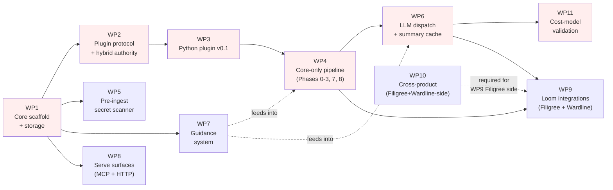

# Clarion v0.1 — Implementation Plan (High-Level Overview)

**Status**: AMENDED — Sprint 1 closed (`v0.1-sprint-1`); Sprint 2 resequenced under [`sprint-2/scope-amendment-2026-05.md`](./sprint-2/scope-amendment-2026-05.md). The WP body below is the original framing and remains the architectural reference; the resequence memo is the authoritative source for what ships in v0.1 vs. what slips to v0.2. **Read both.**
**Date opened**: 2026-04-18
**Last amended**: 2026-05-16
**Plan owner**: John Morrissey (primary dev of Clarion, Filigree, Wardline)
**Predecessor**: [`../clarion/v0.1/plans/v0.1-scope-commitments.md`](../clarion/v0.1/plans/v0.1-scope-commitments.md) (scope locked 2026-04-18)
**Amendments**: [`sprint-2/scope-amendment-2026-05.md`](./sprint-2/scope-amendment-2026-05.md) (2026-05-16 — narrows WP6, splits WP9 into A/B, defers WP4/5/7/10/11-as-scheduled, pulls WP8 + WP9-A into Sprint 2 for MVP MCP surface)
**Audience**: implementation engineer (the author + future contributors), Filigree-side
issue-tracker seeder, design reviewers checking that every system-design section has an
owning work package.

---

## 1. Purpose

The v0.1 design freeze is complete: requirements are baselined, system-design and
detailed-design are written, 12 ADRs are Accepted, and three minimal-core scope decisions
are locked. This plan turns that design surface into **11 work packages (WPs)** in
dependency order, with each WP anchored to:

- the system-design and detailed-design sections it implements,
- the requirements and ADRs it satisfies,
- its scope, deliverables, and exit criteria,
- the backlog ADRs it is expected to surface.

This is the **high-level overview**. It is not a TDD task list; per-WP execution plans
(bite-sized steps) will be written when each package is picked up.

## 2. How this plan was derived

The system-design's `Addresses:` headers (one per §2–§11 section) define the requirement
acceptance surface for each subsystem. Work packages were carved by grouping subsystem
sections that share dependencies, share storage shape, or must ship together for any
end-to-end behaviour to be testable. Cross-product work (WP9, WP10) is explicit so the
Filigree-side and Wardline-side changes do not silently fall outside the plan, since the
same author owns all three repos.

Sequencing is driven by **data flow**: schema → extraction → enrichment → summarisation
→ emission. The no-LLM phases (WPs 1–4) can ship and be end-to-end tested using the
RecordingProvider primitive (see §5) before any Anthropic spend is incurred (WP6).

## 3. Critical path and parallelism

**Critical path** (red): WP1 → WP2 → WP3 → WP4 → WP6 → WP11.

**Parallelisable once WP1+WP2 land**:
- WP5 (secret scanner) — pre-Phase-1 hook, independent of pipeline detail.
- WP7 (guidance) — needs WP1 storage only; integrates into WP4 and WP6.
- WP8 (serve surfaces) — read-only; needs WP1 storage.
- WP10 (cross-product) — independent repos, same author; can start any time.

## 4. Work-package summary

| WP | Title | Anchoring system-design + detailed-design | Accepted ADRs | Backlog ADRs likely surfaced |
|---|---|---|---|---|
| WP1 | Core scaffold + storage | sys §4 + det §3 | ADR-001, ADR-003, ADR-011 | ADR-005 |
| WP2 | Plugin protocol + hybrid authority | sys §2 + det §1 | ADR-002, ADR-021, ADR-022 | — |
| WP3 | Python plugin v0.1 | det §1 (Python specifics) | ADR-018, ADR-022 | — |
| WP4 | Core-only pipeline (Phases 0–3, 7, 8) | sys §6 + det §5 | ADR-006, ADR-017 | — |
| WP5 | Pre-ingest secret scanner | sys §10 + det §5 | ADR-013 | — |
| WP6 | LLM dispatch + policy + summary cache (Phases 4–6) | sys §5 + sys §6 + det §4 | ADR-007 | — |
| WP7 | Guidance system | sys §7 + det §2 | — | ADR-009 |
| WP8 | MCP consult + HTTP read API | sys §8 + sys §9 + det §6 + det §7 | ADR-012 | ADR-010 |
| WP9 | Loom integrations | sys §9 + sys §11 + det §7 | ADR-004, ADR-015, ADR-016, ADR-017, ADR-018 | ADR-020 |
| WP10 | Cross-product (Filigree + Wardline side) | sys §11 prereqs + det §7 | ADR-014, ADR-015 | ADR-019 |
| WP11 | Post-impl cost/perf validation | scope memo §"Validation" | — | — |

## 5. Cross-cutting primitives

These exist across multiple WPs and must be designed once, in WP1, rather than re-invented
per package.

### 5.1 RecordingProvider (testing primitive)

The determinism requirements in `system-design.md` §6 (analyser determinism) and the
summary-cache contract in ADR-007 require that, given identical inputs, Clarion produces
identical outputs. For LLM-bearing phases (WP6) this is impossible to validate against a
live API — it costs money and the API is non-deterministic.

**The primitive**: a trait `LlmProvider` with two implementations:
- `AnthropicProvider` — real network calls, used by `clarion analyze` against real repos.
- `RecordingProvider` — wraps `AnthropicProvider`, records every (request, response) pair
  to a YAML/JSON fixture file on first run; on subsequent runs replays from the fixture
  and fails if the request-shape diverges.

**Where it must be designed**: WP1 (the trait + recording-mode flag). **Where it is
exercised**: WP4 end-to-end tests (no LLM, but proves the seam exists), WP6 unit and
integration tests (full LLM path replayed), WP11 (record once against `elspeth-slice`,
replay forever).

**Why call it out here**: it is the difference between a CI suite that costs $0 per run
and one that costs $5–15 per run. Building it as an afterthought in WP6 risks coupling
the LLM dispatcher to a specific provider in ways that break replay.

### 5.2 Determinism contract

`system-design.md` §6 states that analyser output is deterministic given the same input.
Three concrete implications cut across WPs:

1. **Hash maps must be ordered** at every serialisation boundary. WP1 sets the convention
   (use `BTreeMap` for any structure that crosses the storage or wire boundary).
2. **Clustering algorithm seed** must be fixed. ADR-006 names Leiden with a configurable
   seed defaulting to `0`. WP4 implements this; WP1 should not invent a competing seed
   pattern for any other randomised step.
3. **Wall-clock timestamps in artefacts** must be derived from the input commit (e.g.,
   `git log -1 --format=%cI`), never from `Instant::now()`, except in the `runs` table.
   WP1 enforces this in the artefact-emission helpers; WP4 and WP6 inherit it.

### 5.3 Path jail and resource ceilings

ADR-021 (hybrid plugin authority) requires four core-enforced minimums applied to every
plugin process: path jail, Content-Length ceiling, per-run entity-count cap, per-plugin
RSS limit via `prlimit`. These are implemented once in WP2 and are not per-plugin code.
WP3 (the Python plugin) consumes them transparently; future plugins inherit them.

## 6. Work packages

Each WP follows the same shape:

- **Scope** — what's in.
- **Out of scope (explicit)** — what's deliberately *not* in this WP.
- **Deliverables** — concrete outputs an outside reviewer can point at.
- **Sequencing constraints** — what must be true before this WP can start, and what
  this WP must produce before downstream WPs can start.
- **Exit criteria** — measurable conditions for "done".
- **ADR triggers** — backlog ADRs that this WP is expected to force into authoring.

### WP1 — Core scaffold and storage layer

> **Sprint 1 delivery (narrow walking-skeleton scope)** — closed 2026-04-18. The Sprint 1 slice covers L1 (SQLite schema), L2 (3-segment EntityId format), L3 (writer-actor command protocol) per [`sprint-1/wp1-scaffold.md`](./sprint-1/wp1-scaffold.md). Reader-pool stress timing, `--shadow-db` opt-in, and full pipeline-phase wiring listed below remain on the v0.1 backlog (Sprint 2+). [`sprint-1/signoffs.md §A.1`](./sprint-1/signoffs.md#a1-storage-layer-wp1) is the gate that closed.

**Anchoring docs**: `system-design.md` §4 (Storage), `detailed-design.md` §3 (Storage
implementation), `system-design.md` §1 (process topology).

**Accepted ADRs**: ADR-001 (Rust for the core), ADR-003 (entity ID scheme), ADR-011
(writer-actor concurrency, per-N-files transactions, `--shadow-db` opt-in).

**Scope**:
- Cargo workspace at repo root. Crate decomposition is an implementation choice (a
  reasonable starting point is core library + CLI binary + storage; the boundary may
  shift once WP2's plugin host needs to share types with the core).
- `clarion install | analyze | serve` CLI entry points (skeletons; only `install`
  is functionally complete in WP1).
- SQLite schema as specified in `detailed-design.md` §3 (entities, edges, findings,
  briefings, runs, summaries, guidance, observations).
- Writer-actor implementation per ADR-011: single writable connection, mpsc command
  queue, per-N-files transactions (default `batch_size` per ADR-011), `--shadow-db`
  opt-in.
- Reader-pool with connection-pool management (pool size from `clarion.yaml`).
- Migration framework using sequentially numbered SQL files committed alongside the
  storage code.
- Checkpoint/resume protocol using the `runs` table.
- Cross-cutting primitives §5.1 (`LlmProvider` trait stub + `RecordingProvider`
  scaffolding) and §5.2 (ordered-map convention, wall-clock helper).

**Out of scope (explicit)**:
- Plugin process supervision (WP2).
- Any analysis pipeline phase (WP4).
- LLM API calls (WP6) — only the trait shape exists in WP1.
- HTTP or MCP servers (WP8) — `serve` returns "not implemented" at WP1 exit.

**Deliverables**:
- Compilable Cargo workspace, `cargo test` passes on a hello-world test per crate.
- `clarion install` initialises `.clarion/` correctly: empty `clarion.db` at the right
  schema version, default `clarion.yaml`, `.clarion/` registered for git tracking with
  the run-log subpath excluded (see ADR-005 trigger below).
- Writer-actor passes a stress test that asserts no `database is locked` errors under
  concurrent reader load while the writer commits in batches.
- `--shadow-db` flag observed to write a sibling DB and merge cleanly on completion.

**Sequencing constraints**:
- Nothing blocks WP1.
- WP1 must produce a stable storage schema and writer-actor API before WP2 starts (the
  plugin transport calls into the writer to persist entities).

**Exit criteria**:
- `cargo test --workspace` passes.
- A blank `clarion install` followed by `git add .clarion && git status` shows the
  expected paths tracked and the run log excluded.
- Writer-actor stress test holds at the configured `batch_size` for ≥10 minutes without
  lock errors or memory growth >50 MB above baseline.

**ADR triggers**:
- **ADR-005** (`.clarion/` git-committable, backlog) — WP1 will force a decision on
  exactly which subpaths land in `.gitignore` (logs, temp scratch, shadow DB) versus
  which are committed (the DB itself, manifest, briefings, catalog). Author the ADR
  when implementing `clarion install`.

---

### WP2 — Plugin protocol and hybrid authority

> **Sprint 1 delivery (narrow walking-skeleton scope)** — closed 2026-04-24. The Sprint 1 slice covers L4 (JSON-RPC method set + Content-Length framing), L5 (`plugin.toml` schema), L6 (the four ADR-021 core-enforced minimums), and L9 (plugin discovery convention) per [`sprint-1/wp2-plugin-host.md`](./sprint-1/wp2-plugin-host.md). Multi-plugin orchestration, streaming responses, dynamic plugin loading during `serve`, and seccomp/namespace sandboxing are NOT in Sprint 1 (deferred to later sprints or NG-09 for v0.1). [`sprint-1/signoffs.md §A.2`](./sprint-1/signoffs.md#a2-plugin-host-wp2) is the gate that closed.

**Anchoring docs**: `system-design.md` §2 (Core/Plugin Architecture),
`detailed-design.md` §1 (Plugin implementation detail, language-agnostic portion).

**Accepted ADRs**: ADR-002 (Content-Length framed JSON-RPC subprocess), ADR-021 (hybrid
plugin authority — declared capabilities + core-enforced minimums), ADR-022 (core/plugin
ontology ownership boundary).

**Scope**:
- Plugin-host module (own crate or core sub-module — implementation choice): spawns a
  plugin subprocess, manages stdin/stdout JSON-RPC framing, supervises lifecycle
  (handshake, request/response, shutdown).
- Crash-loop breaker: track per-plugin crash count over a rolling window, fail-fast after
  N crashes per ADR-002.
- Manifest validation (`plugin.toml` per ADR-022): entity kinds, edge kinds, finding
  rule-IDs, ontology version, declared capabilities (RSS ceiling, expected runtime,
  Content-Length max).
- Core-enforced plugin minimums (ADR-021):
  - Path jail (canonicalise + reject any path escaping the analysis root).
  - Content-Length ceiling on every JSON-RPC frame.
  - Per-run entity-count cap (configurable; default in `detailed-design.md` §1).
  - `prlimit`-on-spawn RSS limit derived from manifest's declared capability.
- Ontology boundary enforcement (ADR-022): core rejects any entity kind, edge kind, or
  rule-ID not declared in the manifest.

**Out of scope (explicit)**:
- The Python plugin itself (WP3). WP2 ships only the host side and an in-process mock
  plugin used by tests.
- Multi-plugin orchestration. v0.1 ships one plugin; multi-plugin is NG-09.

**Deliverables**:
- Plugin-host module with the in-process mock-plugin test harness.
- Documented JSON-RPC method set (handshake, `analyze_file`, `resolve_imports`,
  `get_call_graph`, etc., per `detailed-design.md` §1).
- Negative tests: crash-looping mock plugin trips the breaker; manifest declaring an
  RSS ceiling above the system limit is rejected; plugin returning a path outside the
  jail is killed and the entity is rejected.

**Sequencing constraints**:
- Requires WP1 (calls into the writer-actor to persist plugin output).
- Must be stable before WP3 starts; WP3 implements *against* the protocol.

**Exit criteria**:
- All four core-enforced minimums have negative-path tests proving they trip on violation.
- Mock plugin can complete an end-to-end handshake → `analyze_file` → entity persistence
  cycle.
- Crash-loop breaker test holds: 10 crashes within 60s trips the breaker; test asserts
  the host stops respawning.

**ADR triggers**: none expected; ADR-002, ADR-021, ADR-022 already cover the protocol.

---

### WP3 — Python plugin v0.1

> **Sprint 1 delivery (narrow walking-skeleton scope)** — closed 2026-04-28. The Sprint 1 slice covers L7 (Python qualname production format) and L8 (Wardline REGISTRY probe + version-pin protocol) per [`sprint-1/wp3-python-plugin.md`](./sprint-1/wp3-python-plugin.md). Function entities only (module-level + class methods); classes / decorators / module entities, edge emission (`imports`, `calls`, `decorates`, `contains`), import resolution, and the full `CLA-PY-*` rule catalogue are deferred to the WP3-feature-complete sprint. [`sprint-1/signoffs.md §A.3`](./sprint-1/signoffs.md#a3-python-plugin-wp3) is the gate that closed.

**Anchoring docs**: `detailed-design.md` §1 (Python-specific subsections),
`system-design.md` §2 (plugin contract from the plugin's side).

**Accepted ADRs**: ADR-022 (ontology boundary — plugin's manifest is the contract),
ADR-018 (identity reconciliation — the Python plugin is the producer of the
qualnames Clarion translates).

**Scope**:
- Standalone Python package `clarion-plugin-python` (separate `pyproject.toml`).
- `plugin.toml` declaring the Python ontology: entity kinds (module, class, function,
  decorator, etc.), edge kinds (imports, calls, decorates, etc.), rule-IDs (`CLA-PY-*`).
- AST-based detection using `ast` module: classes, functions, decorators, imports.
- Decorator detection sufficient for the rule-IDs listed in `detailed-design.md` §5.
- Import resolution: relative + absolute imports resolved to canonical entity IDs per
  ADR-003.
- Call-graph precision sufficient for the cross-cutting findings in WP4 (intra-module
  resolved; inter-module resolved when import resolution succeeded).
- Structural finding emission for the Python rule catalogue in `detailed-design.md` §5.
- Identity reconciliation hooks per ADR-018: produce qualnames in the form Wardline
  also produces, so downstream translation is a lookup not a guess.

**Out of scope (explicit)**:
- Type inference, dataflow, taint (NG-05).
- Languages other than Python (deferred — `system-design.md` §2 is multi-language ready
  but v0.1 ships Python only).
- Dynamic-import resolution (`importlib`, `__import__`) beyond what `ast` reveals.

**Deliverables**:
- Installable Python plugin (e.g., `pipx install clarion-plugin-python` once published;
  meanwhile `pip install -e .` from the source tree).
- Test suite of Python source fixtures and expected entity/edge/finding output.
- Manifest passing WP2's validator without warnings.
- Round-trip test: feed the plugin its own source tree and assert the emitted catalog
  describes the plugin correctly.

**Sequencing constraints**:
- Requires WP2 (the host).
- Must produce stable output for WP4 (the pipeline consumes it).

**Exit criteria**:
- All Python rule-IDs in `detailed-design.md` §5 have at least one positive and one
  negative fixture; assertions pass.
- The plugin runs against `elspeth-slice` (or stand-in) without exceeding the
  manifest-declared RSS ceiling.

**ADR triggers**: none expected.

---

### WP4 — Core-only pipeline (Phases 0–3, 7, 8)

**Anchoring docs**: `system-design.md` §6 (Analysis pipeline),
`detailed-design.md` §5 (rule catalogue and example run).

**Accepted ADRs**: ADR-006 (Leiden clustering with Louvain fallback), ADR-017
(severity mapping, rule-ID round-trip, dedup policy).

**Scope**:
- Pipeline orchestrator hosting the seven phases. WP4 implements:
  - **Phase 0 — discovery / dry-run**: walks the analysis root, decides which files
    the plugin will visit, supports `--dry-run`.
  - **Phase 1 — entity/edge ingest**: drives plugin `analyze_file` calls, persists
    entities and edges via the writer-actor.
  - **Phase 2 — graph completion**: resolves cross-file edges, normalises identities
    using ADR-018's translation table.
  - **Phase 3 — clustering**: Leiden on the imports+calls subgraph per ADR-006;
    Louvain fallback when Leiden's quality threshold is not met; deterministic seed.
  - **Phase 7 — cross-cutting structural findings**: rule evaluator producing the
    `CLA-*` finding catalogue from `detailed-design.md` §5; severity per ADR-017.
  - **Phase 8 — entity-set diff**: compares the current run's entity set against the
    previous run's, emits churn metadata for WP6's cache invalidation and WP7's
    guidance fingerprinting.
- Catalog rendering: `catalog.json` + per-subsystem markdown files written under
  `.clarion/`.
- Findings commit: `findings.jsonl` written; format per ADR-004 (Filigree-native
  intake shape, see WP9 for the actual Filigree round-trip).

**Out of scope (explicit)**:
- Phases 4–6 (LLM-bearing summarisation): WP6.
- Pre-Phase-1 secret scan: WP5.
- Findings emission to Filigree: WP9.

**Deliverables**:
- `clarion analyze --no-llm` runs end-to-end on a small Python repo, producing a
  populated DB, `catalog.json`, per-subsystem markdown, and `findings.jsonl`.
- Test fixtures covering each `CLA-*` rule with positive and negative cases.
- Determinism test: running `clarion analyze --no-llm` twice on identical input
  produces byte-identical artefacts.

**Sequencing constraints**:
- Requires WP1, WP2, WP3.
- Should land before WP6; WP6 layers Phases 4–6 on top of the WP4 pipeline.

**Exit criteria**:
- Determinism test passes.
- Cross-cutting rule fixtures pass.
- `clarion analyze --no-llm` against the Clarion docs tree (a real Python-light input)
  completes without errors and produces a non-empty catalog.

**ADR triggers**: none expected (the pipeline ADRs are already authored).

---

### WP5 — Pre-ingest secret scanner

**Anchoring docs**: `system-design.md` §10 (Security), `detailed-design.md` §5
(pipeline integration point — runs before Phase 1).

**Accepted ADRs**: ADR-013 (pre-ingest secret scanner with LLM-dispatch block).

**Scope**:
- Rust-native secret-detection module (port the small subset of detect-secrets rules
  enumerated in ADR-013; no Python runtime dependency in core).
- Baseline YAML at `.clarion/secrets-baseline.yaml` for accepted exceptions.
- File-level block: any file with an unbaselined high-confidence detection is excluded
  from Phase-1 entity ingest entirely.
- Briefing suppression: detected files do not appear in briefings even by name (ADR-013
  threat-model row).
- `--allow-unredacted-secrets` flag with explicit operator gating; emits a
  `CLA-SEC-OVERRIDE` finding to make the override visible.

**Out of scope (explicit)**:
- General SAST scanning (Wardline's territory).
- Secret-rotation guidance.
- Network-based secret-validation lookups (e.g., calling the AWS API to check whether
  a key is live).

**Deliverables**:
- Scanner runs as the first step of `clarion analyze`, before plugin spawn.
- Baseline file format documented and round-trip tested.
- Negative test: a file containing a known live-style secret pattern is excluded; the
  briefing for the containing subsystem omits the file; a `CLA-SEC-FILE-EXCLUDED`
  finding is emitted.
- Override test: `--allow-unredacted-secrets` admits the file but emits the override
  finding.

**Sequencing constraints**:
- Requires WP1 (storage for findings) and WP4 (so the "before Phase 1" hook exists).
- Independent of WP2/WP3 specifics; can be developed in parallel with them once WP1
  exits.

**Exit criteria**:
- All ADR-013 rule examples have positive and negative fixtures.
- Override path is exercised and the override finding is visible in `findings.jsonl`.

**ADR triggers**: none expected.

---

### WP6 — LLM dispatch, policy engine, summary cache (Phases 4–6)

**Anchoring docs**: `system-design.md` §5 (Policy engine), `system-design.md` §6
(Phases 4–6), `detailed-design.md` §4 (policy engine config and caching internals).

**Accepted ADRs**: ADR-007 (5-part summary cache key with TTL backstop and
churn-eager invalidation).

**Scope**:
- `clarion.yaml` config loader and merge semantics (project root + user home + CLI
  override precedence per `detailed-design.md` §4).
- Anthropic SDK wrapper implementing `LlmProvider` trait from WP1's §5.1 primitive.
  - `temperature: 0` enforced.
  - Model-tier mapping (Haiku for leaves, Sonnet for modules, Opus reserved for the
    cases enumerated in `detailed-design.md` §4).
  - Retry with backoff and a hard per-run cost ceiling.
- Prompt templates for leaf, module, and subsystem summarisation (one template per
  tier; templates are versioned alongside the core code, with the exact path
  determined by WP1's crate decomposition).
- Summary cache:
  - 5-part key per ADR-007: (input-hash, prompt-template-version, model-tier,
    ontology-version, churn-eager invalidation tag).
  - TTL backstop (default in ADR-007).
  - Churn-eager invalidation driven by Phase-8's diff (WP4): if any edge into or
    out of the entity changed, the cache entry is invalidated regardless of TTL.
- Pipeline phases:
  - **Phase 4 — leaf summarisation**: per-entity Haiker calls, results into `summaries`
    table.
  - **Phase 5 — module summarisation**: aggregates leaf summaries into module summaries.
  - **Phase 6 — subsystem summarisation**: aggregates module summaries into subsystem
    summaries; produces the briefing inputs WP7 composes.
- All phases gated behind RecordingProvider replay in CI; live-Anthropic runs require
  an explicit `CLARION_LLM_LIVE=1` env var.

**Out of scope (explicit)**:
- Cost-model validation (WP11 — that's the post-impl spike).
- Briefing composition itself (WP7).
- The MCP/HTTP surfaces that consume summaries (WP8).

**Deliverables**:
- `clarion analyze` (without `--no-llm`) completes end-to-end on a small fixture using
  RecordingProvider; the recorded fixture is checked in.
- Cache test suite: cache-hit, cache-miss, TTL expiry, churn-eager invalidation each
  asserted with a focused test.
- Cost-ceiling test: a configured per-run ceiling causes a clean abort with no DB
  corruption.

**Sequencing constraints**:
- Requires WP1 (storage, `LlmProvider` trait), WP4 (Phases 0–3 producing the inputs).
- Should land before WP9 (Loom integrations consume summaries via briefings).

**Exit criteria**:
- Determinism test: re-running with the same RecordingProvider fixture produces
  byte-identical summaries.
- Cache-hit-rate assertion on a two-run sequence (cold then warm) ≥ a configurable
  threshold (initial threshold in `clarion.yaml`; the actual NFR-COST-02 ≥95% number
  is validated in WP11, not here).

**ADR triggers**: none expected (ADR-007 is comprehensive).

---

### WP7 — Guidance system

**Anchoring docs**: `system-design.md` §7 (Guidance system),
`detailed-design.md` §2 (data model — guidance shapes).

**Accepted ADRs**: none directly; depends on the guidance data model in
`detailed-design.md` §2.

**Scope**:
- Guidance sheet format (YAML per `detailed-design.md` §2): scope, applies-to rules,
  body markdown, fingerprint inputs.
- Composition algorithm: at briefing-render time, walk the entity tree and accumulate
  applicable guidance sheets per the precedence rules in `system-design.md` §7.
- Fingerprinting: hash inputs to detect stale guidance (anchored to entity churn from
  WP4 Phase 8).
- Match rules: glob, scope-prefix, label-set per `detailed-design.md` §2.
- Findings:
  - `CLA-FACT-GUIDANCE-CHURN-STALE` — guidance sheet anchored to an entity whose
    fingerprint changed since the sheet was last edited.
  - `CLA-FACT-GUIDANCE-ORPHAN` — guidance sheet whose target entity no longer exists.

**Out of scope (explicit)**:
- A guidance authoring UI (the v0.2 wiki — NG-13).
- Guidance versioning beyond fingerprint detection.

**Deliverables**:
- `.clarion/guidance/` directory layout documented and parsed by `clarion analyze`.
- Composition test: a multi-sheet fixture produces the expected merged guidance per
  precedence rules.
- Stale and orphan findings have fixtures that exercise both rules.

**Sequencing constraints**:
- Requires WP1 (storage). Independent of WP2/WP3/WP4 detail in the structural sense,
  but findings only reach `findings.jsonl` once WP4's Phase-7 evaluator can host them.

**Exit criteria**:
- Composition produces deterministic merged-guidance output (byte-equal across runs).
- Stale and orphan findings appear in `findings.jsonl` for the fixture cases.

**ADR triggers**:
- **ADR-009** (structured briefings vs free-form prose, backlog) — WP7 will surface a
  decision on whether guidance bodies are structured (sections, slot-based) or free
  prose. Author the ADR once the composition algorithm reveals the practical answer.

---

### WP8 — MCP consult surface and HTTP read API

**Anchoring docs**: `system-design.md` §8 (MCP consult surface),
`system-design.md` §9 (Integrations — HTTP read API portion),
`detailed-design.md` §6 (MCP tool catalogue), `detailed-design.md` §7 (HTTP detail).

**Accepted ADRs**: ADR-012 (HTTP read-API authentication — UDS default with token
fallback).

**Scope**:
- `clarion serve` with two surfaces:
  - **MCP over stdio**: tools enumerated in `detailed-design.md` §6, with session
    state for cursor-based navigation, structured response envelope per the MCP
    contract.
  - **HTTP read API on loopback**: endpoints enumerated in `detailed-design.md` §7
    for sibling tool consumption (Wardline-in-CI, etc.).
- Auth per ADR-012:
  - Default: Unix domain socket at mode `0600`, no token required (file-perm trust).
  - Fallback: TCP loopback with auto-minted token written to a chmod-`0600` file
    when UDS is unavailable.
  - `serve.auth: none` is forbidden in production; if explicitly set, emit a
    `CLA-SEC-SERVE-AUTH-NONE` finding at startup.

**Out of scope (explicit)**:
- The HTTP write API (`POST /entities`, etc.) — deferred to v0.2 per scope memo.
- The semi-dynamic wiki — deferred to v0.2 (NG-13).

**Deliverables**:
- `clarion serve` runs and accepts MCP connections; tool catalogue matches
  `detailed-design.md` §6.
- HTTP API exposes the read endpoints from `detailed-design.md` §7; auth path tested
  for both UDS and TCP-token modes.
- `serve.auth: none` produces the warning finding.

**Sequencing constraints**:
- Requires WP1 (storage). Read-only; does not block WP9.

**Exit criteria**:
- MCP tool catalogue tests pass: each tool has a positive call test asserting the
  response shape matches `detailed-design.md` §6.
- Auth tests: UDS path works without a token; TCP-loopback path requires the
  auto-minted token; missing token returns 401.

**ADR triggers**:
- **ADR-010** (MCP as first-class surface, backlog) — WP8 may want the lock-in record.
  Author the ADR if the implementation reveals trade-offs (e.g., MCP cursor semantics
  diverging from a future HTTP-tool catalogue) worth pinning.

---

### WP9 — Loom integrations (Filigree + Wardline, Clarion side)

**Anchoring docs**: `system-design.md` §9 (Integrations),
`system-design.md` §11 (Suite bootstrap), `detailed-design.md` §7 (integrations
implementation).

**Accepted ADRs**: ADR-004 (Filigree-native finding intake format),
ADR-015 (Wardline→Filigree emission ownership; v0.1 = Clarion-side SARIF translator),
ADR-016 (observation transport — MCP-spawn for v0.1, Filigree HTTP endpoint for v0.2),
ADR-017 (severity and dedup policy applied to emitted findings),
ADR-018 (identity reconciliation — direct REGISTRY import with version pinning).

**Scope**:
- **Filigree finding emission**: WP4's `findings.jsonl` is also POSTed to Filigree's
  `/api/v1/scan-results` per ADR-004. Severity-map and rule-ID round-trip per ADR-017.
  Dedup policy applied per ADR-017 (existing-finding update vs new-finding create).
- **Filigree observation emission**: per ADR-016, observations are sent by spawning
  the `filigree mcp` CLI as a subprocess and issuing the `observe` tool call. No
  HTTP transport in v0.1.
- **Wardline integration**:
  - Direct Python import of `wardline.core.registry.REGISTRY` from the Python plugin
    (WP3) at startup, with a version pin documented in the plugin's manifest.
  - Wardline-config ingestion (`wardline.yaml`, overlays, fingerprint, exceptions,
    SARIF baseline) at analyse-time, producing the augmentation annotations described
    in `system-design.md` §9.
- **Suite-compat probe**: at startup, `clarion analyze` checks Filigree and Wardline
  versions/availability and falls back per the matrix in `system-design.md` §11.
- **Fallback flags**: `--no-filigree` and `--no-wardline` short-circuit the respective
  integrations and produce the documented degraded-mode behaviour.

**Out of scope (explicit)**:
- Filigree `registry_backend: clarion` mode (that's WP10 — Filigree-side work).
- Wardline-native finding emitter (deferred to v0.2 per ADR-015).
- Observation HTTP transport (deferred to v0.2 per ADR-016).

**Deliverables**:
- End-to-end test: `clarion analyze` against a Python fixture writes findings both
  to local `findings.jsonl` and via POST to a fake Filigree HTTP server; assertions
  check shape and severity per ADR-017.
- Observation test: a Phase-7 finding configured to also produce an observation
  results in a `filigree mcp observe` subprocess call (mocked in CI).
- Fallback tests: `--no-filigree` and `--no-wardline` runs produce the expected
  degraded artefacts and no network calls.

**Sequencing constraints**:
- Requires WP4 (the findings to emit) and WP6 (briefings that reference summaries).
- Filigree-side integration depends on WP10 having shipped `registry_backend: clarion`
  *only if* Clarion is operating in non-shadow mode against a real Filigree. In
  shadow-registry mode, WP10 is not blocking for WP9.

**Exit criteria**:
- Compat-probe matrix exercised: Filigree present, Filigree absent, Wardline present,
  Wardline absent — each path produces the documented behaviour.
- Severity-map round-trip: every Clarion `CLA-*` rule-ID has a defined Filigree-side
  severity; round-trip preserves the rule-ID.

**ADR triggers**:
- **ADR-020** (degraded-mode policy and explicit suite fallbacks, backlog) — the
  compat-probe implementation will surface the precise contract for "what does Clarion
  do when sibling X is at version Y < required". Author once the matrix is concrete.

---

### WP10 — Cross-product (Filigree- and Wardline-side changes)

**Anchoring docs**: `system-design.md` §11 (Suite bootstrap — prerequisites),
`detailed-design.md` §7 (integration implementation, sibling-side hooks).

**Accepted ADRs**: ADR-014 (Filigree `registry_backend` flag and pluggable
`RegistryProtocol`), ADR-015 (the Wardline-side counterpart of the SARIF emission
ownership decision).

**Scope**:
- **Filigree side** (separate repo, same author):
  - Add `registry_backend` config flag to Filigree's settings.
  - Define `RegistryProtocol` trait/interface; refactor file-registry call sites
    to go through it.
  - Implement `registry_backend: clarion` mode that delegates to Clarion's entity
    catalog over the HTTP read API (WP8) or a local DB read.
  - Preserve `registry_backend: local` as the default so Filigree alone keeps working.
  - Add `scan_source` field to Filigree's finding records so Clarion-emitted findings
    can be distinguished from Filigree-native ones.
  - Contract test: a recorded Clarion `findings.jsonl` POSTed to Filigree round-trips
    cleanly.
- **Clarion side**:
  - `clarion sarif import` translator that reads a Wardline SARIF file, translates
    to Clarion's finding shape, and POSTs to Filigree (the v0.1 stand-in for the
    deferred Wardline-native emitter — ADR-015).
  - SARIF property-bag preservation per the rules WP10 will surface (see ADR-019
    trigger below).

**Out of scope (explicit)**:
- Wardline-native emitter (v0.2 deferral per ADR-015 spike).
- Filigree HTTP observation endpoint (v0.2 per ADR-016).
- Any UI work in Filigree.

**Deliverables**:
- Filigree PR (or commit series) implementing `RegistryProtocol` + the `clarion`
  backend; Filigree's existing test suite continues to pass.
- `clarion sarif import` subcommand with a Wardline SARIF fixture and a round-trip
  test.
- Schema-compatibility pin per NFR-COMPAT-01.

**Sequencing constraints**:
- Independent of WP1–WP9 *implementation* sequencing; can start any time the same
  author has bandwidth, since the repos are independent.
- Filigree-side `registry_backend: clarion` mode must ship before WP9's non-shadow
  mode is testable end-to-end.

**Exit criteria**:
- Filigree contract test passes against a Clarion-emitted `findings.jsonl`.
- `clarion sarif import` round-trip preserves rule-ID, severity, and the property-bag
  fields named in ADR-019 (once authored).

**ADR triggers**:
- **ADR-019** (SARIF property-bag preservation, backlog) — WP10's translator will
  force a decision on which Wardline SARIF property-bag fields are preserved in the
  Filigree-side record. Author once the translator's property-mapping table is
  concrete.

---

### WP11 — Post-implementation cost/perf validation

**Anchoring docs**: [`../clarion/v0.1/plans/v0.1-scope-commitments.md`](../clarion/v0.1/plans/v0.1-scope-commitments.md)
§"Validation".

**Accepted ADRs**: none — this is a measurement task, not a design task.

**Scope**:
- Run `clarion analyze` against `elspeth-slice` (smallest viable subset; target ~50
  files representative of production density) using the `AnthropicProvider` (live
  API) twice: first to populate the cache, second to measure cache-hit rate.
- Capture: per-run cost (USD), cache-hit rate, wall-clock time, per-phase breakdown.
- Compare against the speculative NFR envelopes:
  - **NFR-COST-01** — $15 per run, ±50%.
  - **NFR-COST-02** — ≥95 % cache hit on the second run.
  - **NFR-PERF-01** — ≤60 minutes wall clock.
- Record results in this folder under `v0.1-validation-results.md` (created in WP11).
- If any NFR is materially wrong, either revise the requirement (with rationale) or
  adjust design (cache key, model-tier mapping, phase scope) and re-run.

**Out of scope (explicit)**:
- Designing additional NFRs.
- Re-validating once requirements are revised — that's a v0.2 concern.

**Deliverables**:
- `v0.1-validation-results.md` with the three NFR rows: each is `validated`,
  `revised`, or `failed-and-redesigned`, with the measured numbers.
- Updated NFR rationale sections in [`../clarion/v0.1/requirements.md`](../clarion/v0.1/requirements.md)
  reflecting reality, not speculation.

**Sequencing constraints**:
- Requires WP6 (LLM dispatch) at minimum. WP9 + WP10 are not strictly required (the
  spike measures Clarion-only metrics) but would be present if WP11 is the last
  package.

**Exit criteria**:
- All three NFRs are categorised (`validated` / `revised` / `failed-and-redesigned`).
- Requirements doc is updated to match the recorded outcome.

**ADR triggers**: none expected. If WP11 reveals a structural problem (e.g., the
cache-key shape from ADR-007 is wrong), a follow-up ADR amendment is the correct
response — but that is not anticipated and is not pre-allocated here.

## 7. Backlog ADR triggers — summary

| Backlog ADR | Title | Surfaces in WP | Trigger condition |
|---|---|---|---|
| ADR-005 | `.clarion/` git-committable subpaths | WP1 | When implementing `clarion install`, decide which subpaths are tracked vs ignored. |
| ADR-009 | Structured briefings vs free-form prose | WP7 | When the guidance composition algorithm reveals what structure (if any) is required. |
| ADR-010 | MCP as first-class surface | WP8 | If MCP cursor semantics diverge from the HTTP-tool catalogue in a way worth pinning. |
| ADR-019 | SARIF property-bag preservation | WP10 | When the `clarion sarif import` translator's property-mapping table is concrete. |
| ADR-020 | Degraded-mode policy and explicit fallbacks | WP9 | When the suite-compat probe matrix is concrete. |

None of these is a day-one blocker. Each is authored lazily, when its WP forces the
decision.

## 8. Open questions / known unknowns

These are not blockers, but they are the questions a reviewer might reasonably ask
that this plan does not yet answer:

- **Q1**: Are the Filigree-side `registry_backend: clarion` mode and the
  Wardline-config ingestion in WP9 testable in CI without a live Filigree/Wardline
  install? Plan assumes yes (mocked HTTP server + checked-in `wardline.yaml` fixture)
  but the first WP9 task should confirm.
- **Q2**: Does the RecordingProvider primitive in WP1 handle streaming Anthropic
  responses correctly? If WP6 needs streaming, the recording format may need to be
  designed for it from the start. WP1 should default to non-streaming and revisit if
  WP6 finds it necessary.
- **Q3**: Should `clarion analyze --no-llm` be a permanent supported mode (used by
  WP4 testing forever) or a transitional flag removed at WP6 exit? Plan assumes
  permanent — it has independent value as a "structural-only catalog" mode for users
  who don't want LLM cost.

## 9. Filigree seeding (recommended next step)

The Filigree instance for this project currently has one open issue
(`clarion-0d21d9c2ac`, release "Future", P4) — effectively empty. The natural next
move is to seed WPs 1–11 as Filigree issues with cross-WP `blocks` dependencies, so
`filigree ready` becomes the canonical start-work surface.

Suggested issue shape (one issue per WP):

- **Title**: `WP<N> — <title>`
- **Labels**: `release:v0.1`, `wp:<N>`, plus a label for each anchoring ADR
  (`adr:001`, etc.) to make the dependency surface searchable.
- **Body**: link back to the relevant section of this plan (anchor `#wpN-<title>`),
  with the WP's exit criteria as a checkbox list.
- **Dependencies** (set via `add-dep`): WP2 depends-on WP1, WP3 depends-on WP2,
  WP4 depends-on WP3, etc. — matches the critical-path diagram in §3.

Seeding is **not** done by this plan; it is a follow-up action item.

## 10. References

- [Clarion v0.1 requirements](../clarion/v0.1/requirements.md)
- [Clarion v0.1 system design](../clarion/v0.1/system-design.md)
- [Clarion v0.1 detailed design](../clarion/v0.1/detailed-design.md)
- [Clarion ADR index](../clarion/adr/README.md)
- [v0.1 scope commitments memo](../clarion/v0.1/plans/v0.1-scope-commitments.md)
- [Loom suite doctrine](../suite/loom.md)
